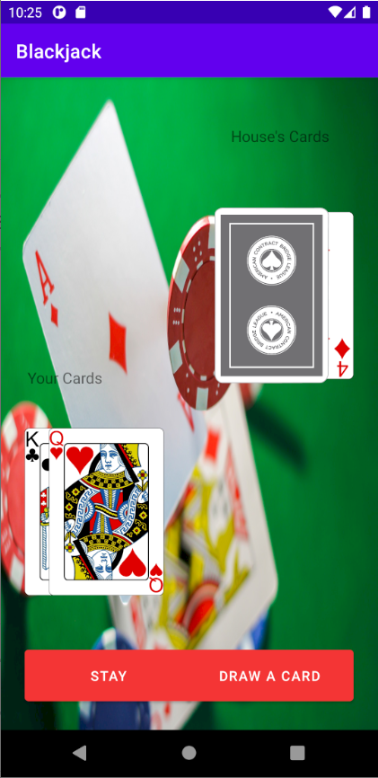
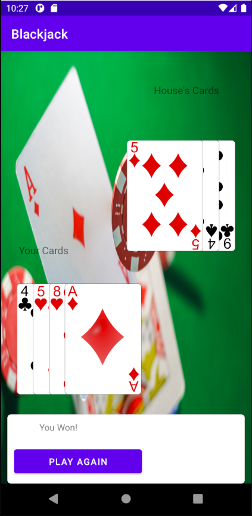

# Blackjack Summary
 Android app made in android studio that allows the user to play the card game blackjack. Written in Java and makes calls to the a deck API. Here is the website used https://deckofcardsapi.com/.
 
    
# Technology 
Java 8  
Android 11

# Rules used
1. All ties result in player victory  
2. After every hand is played, card deck is reshuffled (Only 1 deck is used)    
3. After player Stays, House's hand will draw until hand's value is 16+.    
4. House starts with one face down card that is revealed after player Stays or Busts.

       
